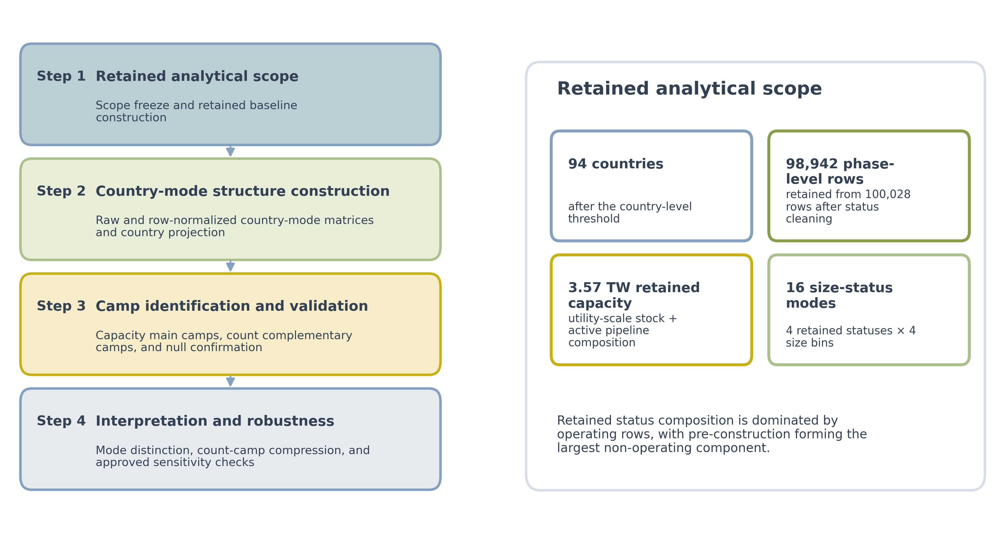
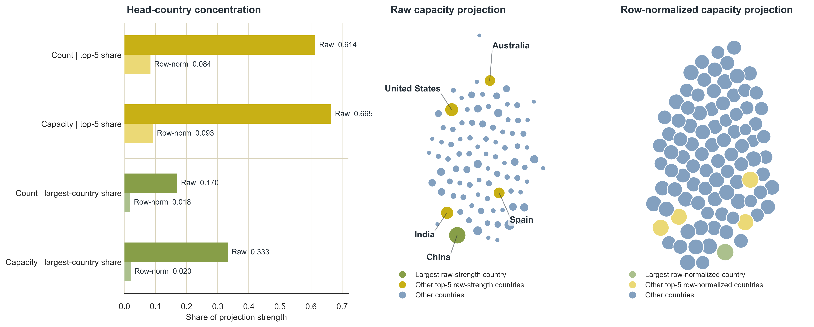
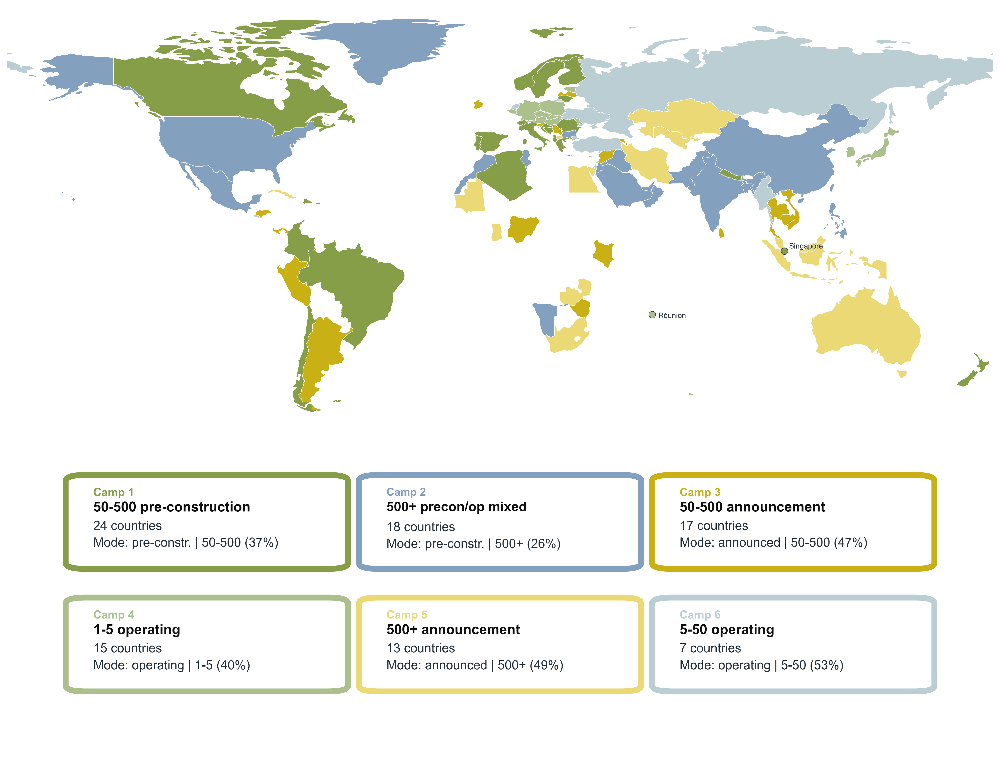
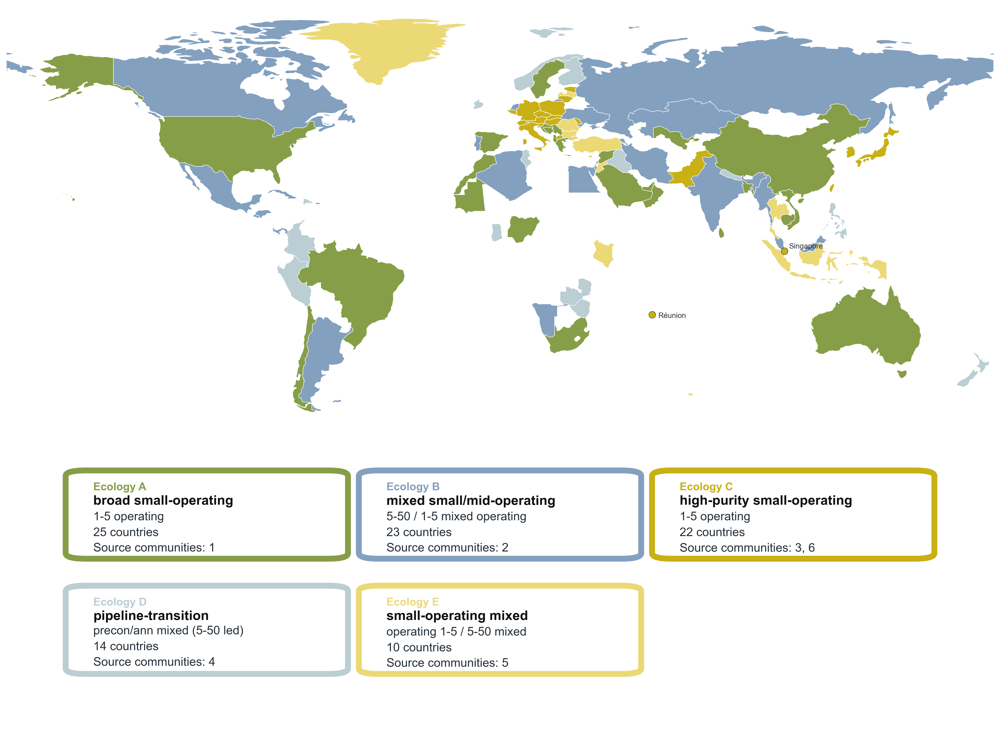
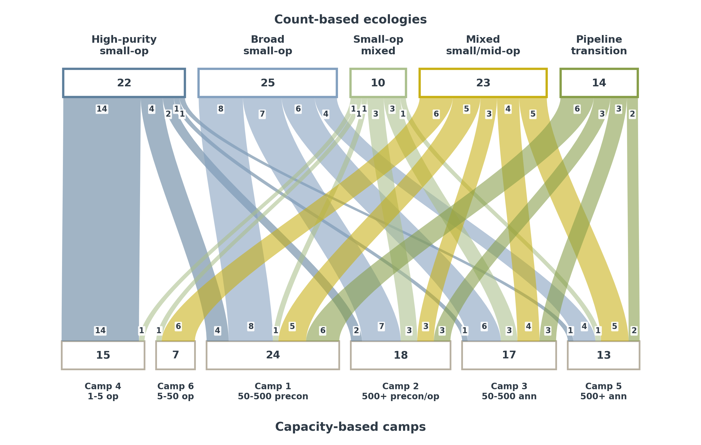
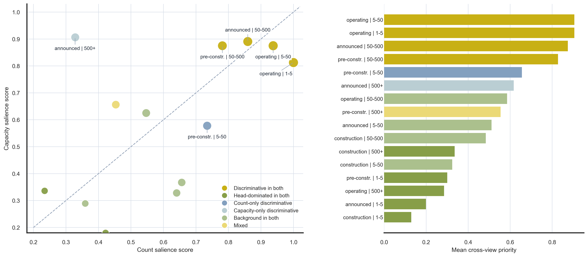

# Beyond Megawatts: Global Solar Project Ecologies

Reproducibility repository for the published *Energy, Ecology and Environment* article:

> Wang, H., Hong, C. & Sun, J. (2026). [Beyond megawatts: Structural configurations and project ecologies in global utility-scale solar](https://doi.org/10.1007/s40974-026-00428-5). *Energy, Ecology and Environment*.

## Quick Links

- [Read the published paper (DOI)](https://doi.org/10.1007/s40974-026-00428-5)
- [Citation metadata](CITATION.cff)
- [Data sources and placement](DATA_SOURCES.md)
- [Analysis notebooks](notebooks/)

## Repository Status

This repository accompanies the version of record published on July 11, 2026. It contains the analysis workflow and final article figures. Third-party source data are not redistributed.

## Overview

The study compares national utility-scale solar portfolios using 16 predefined size-status modes. It separates two related but non-equivalent views:

- **System weight:** capacity-weighted profiles that identify six national camps.
- **Project ecology:** count-weighted profiles that identify five project-frequency ecologies.

The workflow builds retained phase-level tables, derives country-mode matrices, detects communities, audits mode distinction, evaluates null and sensitivity specifications, and assembles article figures and tables.

## Published Findings

- Similar aggregate megawatt totals can conceal materially different internal project structures.
- Capacity and project-count views provide complementary, only partially aligned descriptions of national solar portfolios.
- A limited subset of size-status modes contributes disproportionately to cross-national differentiation.
- The principal structural patterns remain interpretable under null-model and sensitivity checks.

## Figures

The final published figure files are available in [`figures/`](figures/).

| Figure | Preview |
| --- | --- |
| Figure 1 |  |
| Figure 2 |  |
| Figure 3 |  |
| Figure 4 |  |
| Figure 5 |  |
| Figure 6 |  |

## Reproduction

Python 3.11 or newer is recommended.

```bash
python -m venv .venv
source .venv/bin/activate
python -m pip install -r requirements.txt
```

Download the two source datasets described in [`DATA_SOURCES.md`](DATA_SOURCES.md), place them under `data/`, and run:

```bash
python run_pipeline.py
```

Executed notebooks are written to `artifacts/executed_notebooks/`. Intermediate tables and regenerated figures are written under `artifacts/`; this directory is intentionally excluded from version control.

## Reproduction Files

The numbered notebooks form the public analysis path:

1. `01_retained_base_tables.ipynb`
2. `02_core_matrices_and_normalization.ipynb`
3. `03_community_detection_and_camp_summaries.ipynb`
4. `04_null_model_confirmation.ipynb`
5. `05_mode_distinction_audit.ipynb`
6. `06_count_camp_merge_audit.ipynb`
7. `07_sensitivity_suite.ipynb`
8. `08_figure_table_source_assembly.ipynb`
9. `09_manuscript_figures.ipynb`

## Data

The analysis uses the February 2026 release of the Global Solar Power Tracker from Global Energy Monitor. Country boundaries used by the map panels come from Natural Earth. See [`DATA_SOURCES.md`](DATA_SOURCES.md) for source links, expected paths, and the redistribution boundary.

## Scope Notes

- The repository contains the public reproduction path, not submission correspondence, reviewer-response files, internal evidence logs, or manuscript production materials.
- The notebooks preserve the article's predefined size and status definitions. Changing those definitions constitutes a new analysis rather than a direct reproduction.
- Regenerated outputs may vary slightly across library versions where stochastic or layout algorithms are involved.

## Citation

```bibtex
@article{wang2026beyond,
  author  = {Wang, Hairong and Hong, Chengyi and Sun, Jun},
  title   = {Beyond megawatts: Structural configurations and project ecologies in global utility-scale solar},
  journal = {Energy, Ecology and Environment},
  year    = {2026},
  doi     = {10.1007/s40974-026-00428-5},
  url     = {https://doi.org/10.1007/s40974-026-00428-5}
}
```
